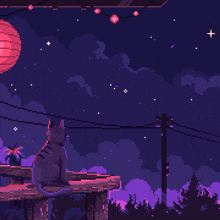

 

<!-- PIXEL CODING ANIMATION -->

 

<strong>🚀 ABOUT ME</strong>
  
<b>A BSIT student from the Philippines, guided by passion and a vision to create meaningful impact through technology.</b> 
Through full-stack, I aim to build games,applications and web that solve real problems, and bring ideas to life 
transforming imagination into experiences that people can truly feel and connect with.

## [ 🌳 SKILL_TREE.EXE ]

### ⚔️ LANGUAGES & FRAMEWORKS
 
 
 
 

### 🕹️ GAME DEV & DESIGN
 
 
 
 
 

### 🛠️ TOOLS & DEPLOYMENT
 
 
 
 

<!-- TRUE BLINKING TEXT (No Typing Reveal) -->

 

<!-- SKILL BADGES -->

 
 

## [ 📜 ACTIVE_QUESTS.LOG ]

  <table>
    <tr>
      <td align="center"><b>SKILL</b></td>
      <td align="center"><b>EXPERIENCE (EXP)</b></td>
      <td align="center"><b>LEVEL</b></td>
    </tr>
    <tr>
      <td></td>
      <td></td>
      <td><code>LVL 5</code></td>
    </tr>
    <tr>
      <td></td>
      <td></td>
      <td><code>LVL 10</code></td>
    </tr>
    <tr>
      <td></td>
      <td></td>
      <td><code>LVL 0</code></td>
    </tr>
  </table>

## [ 📊 SYSTEM STATS ]

  
  

  

## [ 💬 DEV_QUOTES.TXT ]

  

  

## [ 🌐 CONNECT.PORTAL ]

  
  
  

